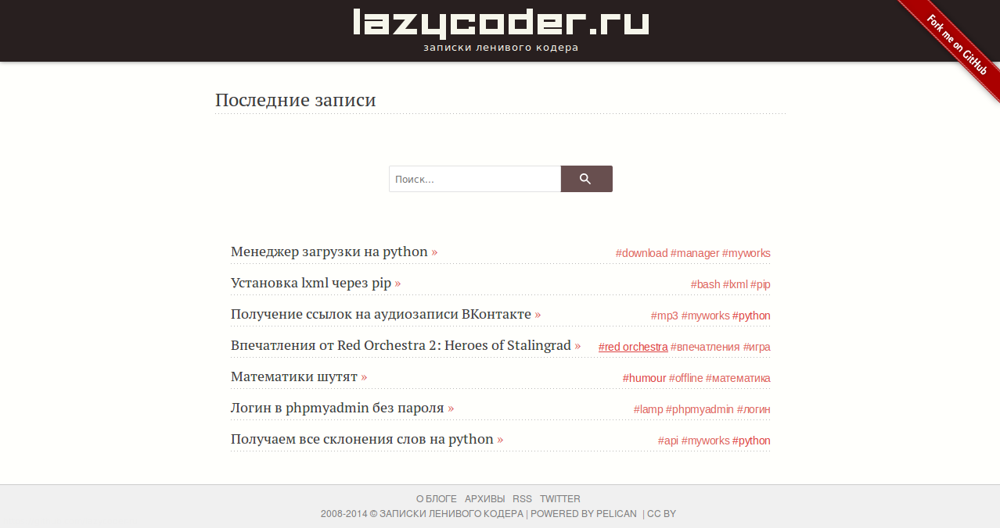

lazystrap
=========

Lazystrap is my very first Pelican theme.
Theme has additional and modified css and js for plugins: lightbox, tipuesearch.
I'm using ``lightbox`` plugin from https://github.com/jprine/pelican-plugins and ``tipuesearch`` from standart pelican plugins directory.

Note, theme hasn't author and category templates.

Note, for correct work, next variables must be set in ``pelicanconf.py`` exactly as in example:
- ``TAG_URL = 'tag/{slug}'``
- ``TAG_SAVE_AS = 'tag/{slug}/index.html'``
- ``ARTICLE_URL = 'blog/{slug}'``
- ``ARTICLE_SAVE_AS = 'blog/{slug}/index.html'``
- ``ARCHIVES_SAVE_AS = 'archives/index.html'``
- ``PAGINATED_DIRECT_TEMPLATES = ('archives',)``
- ``PAGINATION_PATTERNS = ((1, '{base_name}/', '{base_name}/index.html'), (2, '{base_name}/page{number}/', '{base_name}/page{number}/index.html'))``

All theme text was moved to template variables:
- ``ARCHIVES_TITLE = "Archives"``
- ``COMMENTS_TITLE = "Comments"``
- ``FEED_TITLE = "RSS"``
- ``RECENT_POSTS_TITLE = "Recent posts"``
- ``SEARCH_TITLE = "Search"``
- ``PREV_TITLE = "Prev"``
- ``NEXT_TITLE = "Next"``
- ``TAG_PAGE_TITLE = "Post tagged by"``

Other theme variables:
- ``SITENAME = ""``
- ``SITESUBTITLE = ""``
- ``SITEKEYWORDS = ""``
- ``SITEURL = ""``
- ``SOCIAL = (('twitter', 'http://twitter.com/yourusername'),)``
- ``GITHUB_USERNAME = ""``
- ``BLOG_START_YEAR = ""``
- ``COMMENT_SYSTEM_ID = ""``

Screenshot
----------

